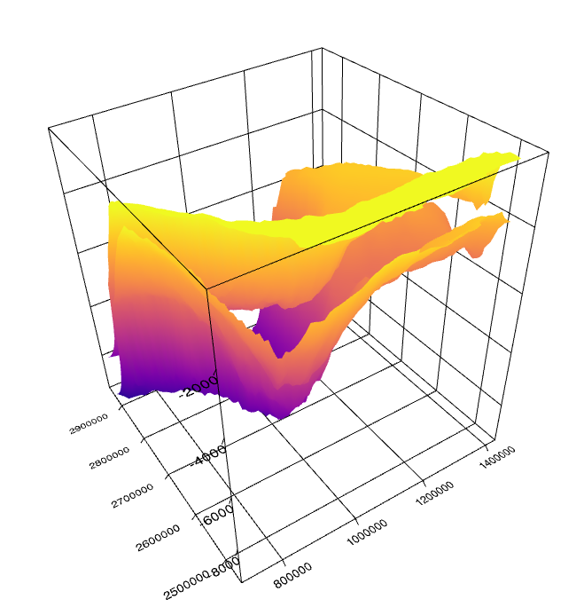

## What is it
Plot surface grid data in 3D. Support reading surface grid data from common subsurface formats

## Functionalities

 - [x] Plot surface grid data using Three.js 
 - [x] Multiple surface
 - [x] Add/Remove surface
 - [x] Read surface data from pmd PetroMod file
 - [ ] Irap Binary file support
 - [ ] Update camera fov on new surface
 - [x] Adjustable vertical exaggeration
 - [ ] Independent colour scale
 - [ ] Adjustable colour scale
 - [ ] Axis labels
 - [ ] Coordinates label
 - [ ] Touch support

## What is new

 - Offscreencanvas: https://developer.mozilla.org/en-US/docs/Web/API/OffscreenCanvas
 - Mouse events proxied to worker
 - WebGL enabled through Three.js
 - WASM + Emscripten's File System API = zero-copy read of binary files
 
## Dependencies
 - Three.js v0.129
 - d3 v7

 ## Credits
 - Three js functionalities are mainly based on http://pappubahry.com/three_d/
 - PMD binary file support is based on https://github.com/equinor/xtgeo/